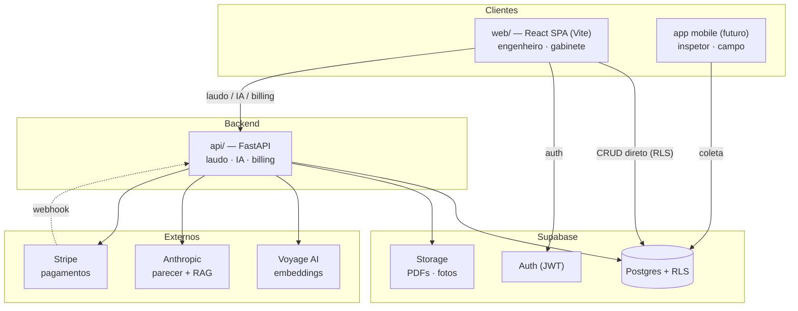

# Relatório Rápido — NR-12

> Inspeções e laudos NR-12, sem complicação.

Plataforma **multi-tenant** para gestão de inspeções de máquinas e equipamentos
conforme a **NR-12**, com:

- **laudos assistidos por IA** (a IA escreve o parecer técnico a partir dos dados);
- **camada de conhecimento** — busca semântica de não-conformidades, sugestão de
  planos de ação (RAG), "foguinho" de risco por item (Wilson) e sugestão de notas;
- **cobrança** por assinatura **ou** por laudo (Stripe);
- isolamento de dados por **Row-Level Security** no Postgres.

É um produto real **e** o veículo de aprendizado full-stack do autor. A marca
**Relatório Rápido** é uma plataforma multi-norma: este é o módulo **NR-12**
(`nr12.relatoriorapido.com`); o motor já suporta outras normas (NR-13, NR-10…)
apenas semeando uma nova norma — sem reescrever a aplicação.

---

## Arquitetura



**Princípio de fronteira** (vale no front e no back):
**CRUD de cadastro → Supabase direto** (PostgREST + RLS);
**fluxo do laudo / IA / billing → FastAPI**. Ver [`docs/ARCHITECTURE.md`](docs/ARCHITECTURE.md).

---

## Stack

| Camada | Tecnologia |
|---|---|
| Banco | Supabase (Postgres + RLS + Auth + Storage), `pgvector` |
| Backend | Python · FastAPI · supabase-py · reportlab (PDF) |
| IA | Anthropic (Claude — parecer e RAG) · Voyage AI (embeddings) |
| Pagamentos | Stripe (test mode, BRL) |
| Frontend | Vite · React · TypeScript · Tailwind v4 · React Router · TanStack Query · react-i18next |
| Testes | pytest (RLS, integração, segurança) |

---

## Estrutura do repositório

```
nr12-saas/
├─ api/                 # backend FastAPI
│  ├─ app/              #   routers, services, auth, config
│  ├─ scripts/          #   utilitários (token, backfill, etc.)
│  └─ tests/            #   pytest (RLS, billing, segurança, laudo)
├─ web/                 # frontend React (Vite) — ver web/ARQUITETURA.md
├─ supabase/
│  ├─ migrations/       #   schema versionado (0001–0011)
│  └─ seeds/            #   norma NR-12, matriz de risco, planos, demo
└─ docs/
   ├─ ARCHITECTURE.md   #   desenho do sistema (este projeto, em detalhe)
   ├─ BLUEPRINT.md      #   como reconstruir do zero, com o porquê
   ├─ adr/              #   decisões de arquitetura (0001–0008)
   ├─ database/         #   modelo de dados, dicionário, RLS
   └─ api/              #   contrato da API
```

---

## Como rodar (dev)

**Pré-requisitos:** Python 3.12+, Node 20+, um projeto Supabase, e chaves de
Anthropic, Voyage e Stripe (test).

### 1. Banco (migrations + seeds)
Aplique, em ordem, os arquivos de [`supabase/migrations/`](supabase/migrations/)
e [`supabase/seeds/`](supabase/seeds/) no **SQL Editor** do Supabase
(ou `supabase db push`). Habilite a extensão `vector` (Database → Extensions).

### 2. Backend
```bash
cd api
python -m venv .venv && .venv/Scripts/activate      # Windows
pip install -r requirements.txt
# crie api/.env (ver "Variáveis de ambiente")
uvicorn app.main:app --reload                        # http://127.0.0.1:8000/docs
```

### 3. Frontend
```bash
cd web
npm install
# crie web/.env a partir de web/.env.example
npm run dev                                          # http://localhost:5173
```

### 4. Testes
```bash
cd api && .venv/Scripts/python -m pytest tests/ -q
```

---

## Variáveis de ambiente

**`api/.env`** (segredos — nunca commitado):
```
SUPABASE_URL=…
SUPABASE_ANON_KEY=…
SUPABASE_SERVICE_ROLE_KEY=…   # webhook do Stripe
ANTHROPIC_API_KEY=…           # parecer + RAG
VOYAGE_API_KEY=…              # embeddings
STRIPE_SECRET_KEY=sk_test_…
STRIPE_WEBHOOK_SECRET=whsec_… # teste local com Stripe CLI
```

**`web/.env`** (expostas ao browser — a anon key é pública; o RLS protege):
```
VITE_SUPABASE_URL=…
VITE_SUPABASE_ANON_KEY=…
VITE_API_URL=http://127.0.0.1:8000
```

---

## Documentação

| Documento | Para quê |
|---|---|
| [docs/ARCHITECTURE.md](docs/ARCHITECTURE.md) | Desenho do sistema: fronteiras, RLS, IA, billing, segurança |
| [docs/BLUEPRINT.md](docs/BLUEPRINT.md) | **Reconstruir do zero** — ordem das fases, princípios e método |
| [docs/adr/](docs/adr/) | Decisões de arquitetura registradas (ADR 0001–0008) |
| [docs/database/](docs/database/) | Modelo de dados, dicionário, status do RLS |
| [docs/api/01-contract.md](docs/api/01-contract.md) | Contrato da API do laudo |
| [docs/backend-plan.md](docs/backend-plan.md) | Plano de execução do backend (fases e checkboxes) |
| [web/ARQUITETURA.md](web/ARQUITETURA.md) | Estrutura e princípios do frontend |

> **Docs-first:** toda decisão de arquitetura é registrada como ADR **antes** de
> virar código — não depois.

---

## Status

| Marco | Status |
|---|---|
| 1. Banco & modelagem | 🟢 29 tabelas, RLS + Auth + Storage; isolamento testado |
| 2. Backend (laudo) | 🟢 5 endpoints do laudo + PDF no Storage |
| 3. Camada de conhecimento (IA) | 🟢 busca, RAG, foguinho (Wilson), sugestão de notas |
| 4. Billing (Stripe) | 🟢 assinatura **ou** avulso por máquina + webhook + gate |
| 5. Testes | 🟢 15 pytest (RLS, billing, conhecimento, segurança, laudo) |
| 6. Frontend (web) | 🟡 Fundação + auth + esqueleto (Fase 0–1) |
| 7. Ingestão de campo (n8n/mobile) | ⚪ Não iniciado |
| 8. Deploy | ⚪ Não iniciado (`relatoriorapido.com`) |
