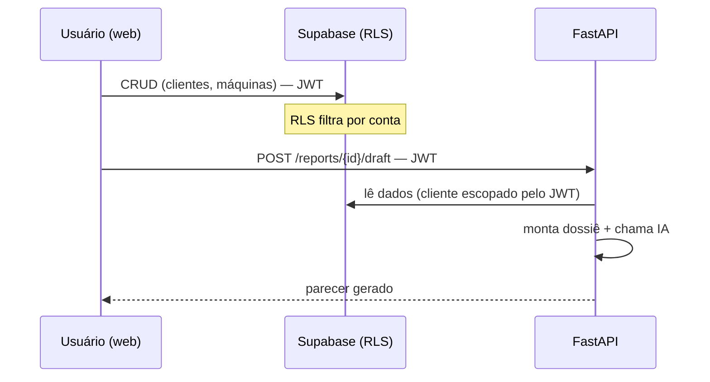
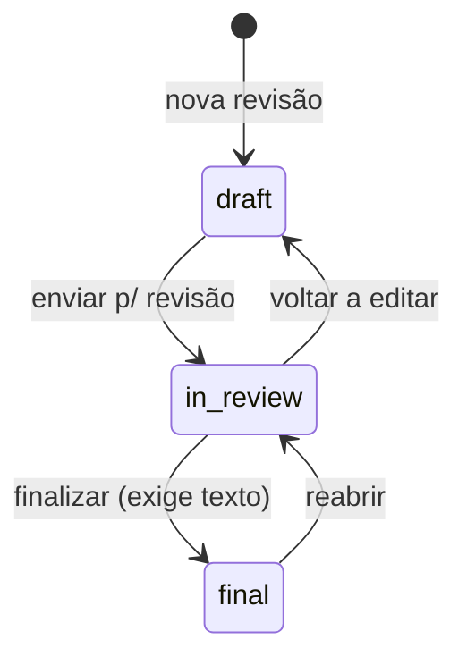
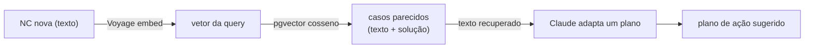
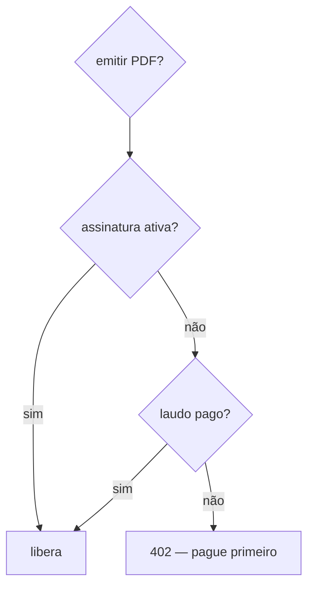

# Arquitetura do sistema

Desenho de alto nível do **Relatório Rápido (NR-12)**: as fronteiras, os fluxos
e os porquês. Para reconstruir do zero, ver [`BLUEPRINT.md`](BLUEPRINT.md). Para
decisões pontuais, ver os [ADRs](adr/).

## 1. A fronteira central: dado vs. fluxo

A regra que organiza **tudo** (front e back):

| Tipo de operação | Vai para | Por quê |
|---|---|---|
| **CRUD** de cadastro (clientes, máquinas, inspeções…) | **Supabase direto** (PostgREST) | já há autenticação + RLS; um backend só para repassar CRUD seria peso morto |
| **Fluxo do laudo, IA, billing** | **FastAPI** | lógica de verdade: orquestra IA, monta PDF, valida transições, fala com o Stripe |

O cliente (web/mobile) carrega o **JWT** do Supabase. Para o Supabase, ele usa o
JWT direto; para o FastAPI, manda o JWT no header `Authorization`, e o backend
recria um cliente Supabase escopado a esse usuário — então **o RLS se aplica
igual nos dois caminhos**.

## 2. Multitenancy & RLS

- Cada **conta** (`accounts`) é um tenant. Usuários são `account_members`
  (papéis). Inspetores são **membros convidados** da conta do engenheiro.
- Toda tabela de tenant tem `account_id` e uma policy `own_account`:
  `account_id IN (select current_account_ids())`. Tabelas de referência (norma,
  matriz, planos) têm RLS com leitura aberta a autenticados.
- Helpers `SECURITY DEFINER`: `current_account_id()` (escalar, default de coluna)
  e `current_account_ids()` (setof, usado nas policies).
- **Onboarding:** o trigger de signup cria só o `profiles`; a conta nasce de
  `create_account()` (chamada no 1º login / cadastro).
- **Auditoria:** `rls_audit()` lista qualquer tabela sem RLS/policy — um teste
  exige que volte vazia (nenhuma tabela desprotegida).
- ADRs: [0002 (RLS)](adr/0002-postgres-supabase-multi-tenant-rls.md),
  [0006 (tenancy normalizada)](adr/0006-normalized-tenancy.md).

## 3. Ciclo do laudo

O laudo é o produto. Ele **evolui em revisões** (corrige-se primeiro o risco mais
alto, depois os menores) e cada revisão é um **artefato congelado** (PDF).

- `POST /inspections/{id}/reports` — abre revisão (próxima `version`, herda número)
- `POST /reports/{id}/draft` — IA escreve o parecer (`ai_generated_text`)
- `PATCH /reports/{id}` — edita `final_text` + transição de status (validada)
- `POST /reports/{id}/pdf` — reportlab monta o PDF → **Storage** → `pdf_path` →
  URL assinada (o binário não trafega pela API). **Bloqueado por billing (402).**
- ADRs: [0004 (versões imutáveis)](adr/0004-immutable-versioning-and-freeze.md),
  [0005 (NC = estado da resposta)](adr/0005-nonconformity-as-response-state.md).

### Risco = valor derivado
O engenheiro informa **gravidade** e **frequência**; o `risk_level` **não é
digitado** — sai de um *lookup* na tabela `risk_matrix_rules` (matriz dirigida
por dados, editável sem deploy). [ADR 0003](adr/0003-data-driven-risk-matrix.md).

## 4. Camada de conhecimento (IA)

Aprende com o histórico de não-conformidades. Tabela `knowledge_entries`: **uma
linha por NC, com texto E vetor lado a lado**.

> Regra de ouro: **embedding = índice de busca; texto = conteúdo.** O embedding é
> de mão única (do vetor não volta o texto), por isso o texto fica guardado junto
> — para mostrar ao engenheiro e para alimentar a IA.

Endpoints (`/knowledge/*`):
- **search** — vizinhança por cosseno (`match_knowledge`, índice HNSW).
- **suggest** — RAG: a IA *escreve* um plano a partir dos casos achados (não
  decodifica o vetor — trabalha sobre o texto recuperado).
- **foguinho** — risco do item em 1–5 🔥 pelo **limite inferior de Wilson**
  (amostra pequena → poucos foguinhos; honesto).
- **rating-suggestion** — distribuição histórica de gravidade/frequência (com
  amostra mínima).
- **common-problems** — problemas típicos do item (o que verificar).

[ADR 0007](adr/0007-knowledge-layer-embeddings.md). Estatística = `GROUP BY`/views,
nunca contadores (fatos vs. agregados; evita drift).

## 5. Billing & entitlement (Stripe)

Dois modelos **alternativos**: assinatura recorrente **ou** avulso por máquina
(pague para liberar o PDF). O direito ao PDF é um **entitlement**:

- `plans` (catálogo, valores em centavos), `subscriptions`, `report_payments`.
- Checkout monta o preço **inline** (sem Price pré-criado). Preços vêm do
  **servidor** — o cliente não adultera valor.
- **Webhook** = fonte da verdade (assina + verifica): `checkout.session.completed`
  marca pago/ativa. Usa cliente `service_role` (chega sem JWT).
- [ADR 0008](adr/0008-billing-stripe.md).

## 6. Storage

Buckets privados; o **caminho começa com o `account_id`**, e a policy de
`storage.objects` só libera se a 1ª pasta for da conta do chamador. PDFs em
`laudos/{account_id}/{report_id}/v{n}.pdf`; download por **URL assinada**.

## 7. Segurança (resumo)

- RLS em todas as tabelas (auditado por teste); Storage isolado por conta.
- JWT validado no FastAPI; token inválido → 401.
- Webhook valida assinatura → 400 se inválida.
- Preços no servidor; `service_role` só no webhook, atualizando por id de
  metadata de evento assinado.
- **Hardening de produção pendente:** restringir CORS, rate-limit nos endpoints
  de IA (custo), reabilitar confirmação de e-mail.

## 8. Plataforma multi-norma

`standards` / `standard_versions` / `standard_items` **não** chumbam NR-12. Uma
nova norma (NR-13, NR-10…) entra como **dados** (seed), reaproveitando todo o
motor: checklist, risco, IA, laudo, billing. Estratégia de marca: subdomínio por
norma (`nr12.`, `nr13.` … `relatoriorapido.com`).
