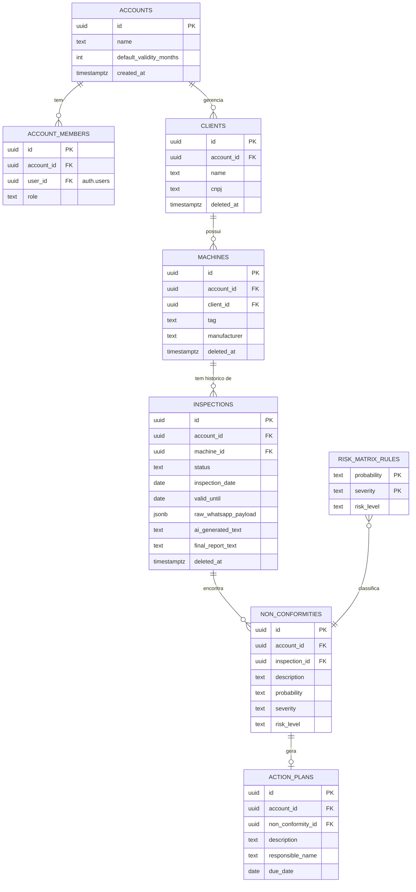

# Modelo de Dados — Conceitual e Lógico

## Modelo conceitual (ERD)



## Entidades — descrição conceitual

| Entidade | Descrição | Pertence a um tenant? |
|---|---|---|
| `accounts` | Uma conta = um tenant = uma consultoria/engenheiro assinante do produto. | É o próprio tenant |
| `account_members` | Usuários (Supabase Auth) vinculados a uma conta. v1: todo membro é `owner`. | Sim |
| `clients` | Empresa cliente da consultoria, dona das máquinas inspecionadas. | Sim |
| `machines` | Máquina/equipamento de um cliente, sujeita a inspeção NR-12. | Sim |
| `inspections` | Uma inspeção realizada numa máquina, com ciclo de vida próprio. | Sim |
| `non_conformities` | Item de não-conformidade encontrado numa inspeção. | Sim |
| `action_plans` | Ação corretiva simples associada a uma não-conformidade. | Sim |
| `risk_matrix_rules` | Tabela de referência global (não tenant-scoped) que mapeia Probabilidade x Severidade → Nível de Risco. | Não — é dado de referência compartilhado |

## Por que `account_id` aparece em quase toda tabela

Ver [ADR 0002](../adr/0002-postgres-supabase-multi-tenant-rls.md): é deliberado.
Mesmo `non_conformities` e `action_plans`, que poderiam derivar o tenant
via join (`non_conformity → inspection → machine → client → account`),
carregam `account_id` diretamente. Isso existe **só** para que as
políticas de RLS sejam uma comparação direta, não uma cadeia de joins.

## Ciclo de vida de `inspections.status`

```
rascunho ──────▶ em_revisao ──────▶ finalizado
   ▲                                    
   │                                    
(criado pelo n8n a partir              (estado terminal — qualquer
 do payload do WhatsApp)                correção gera observação nova,
                                         não reabre o registro)
```

`vencido` **não é um estado armazenado** — é derivado em tempo de
consulta comparando `valid_until` com a data atual (ex: numa view ou
no filtro do dashboard). Isso evita um job/cron que precisaria
"andar" pelas linhas só para mudar um status; a "vencida-ice" é uma
função do tempo, não um evento que aconteceu na inspeção.
