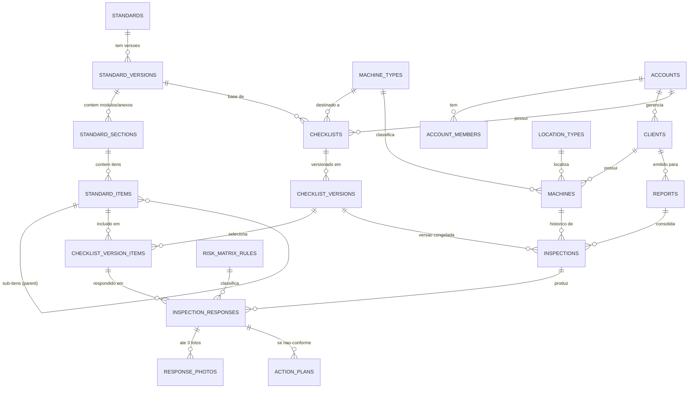

# Modelo de Dados — Conceitual e Lógico

> Identificadores do schema em **inglês** (decisão de 2026-06-19, ver
> [`03-naming-conventions.md`](03-naming-conventions.md)). O **conteúdo**
> dos dados (título da norma, texto das cláusulas, etc.) é em português,
> pois é o domínio NR-12 brasileiro.

## O princípio organizador: três camadas

As entidades vivem em três camadas com comportamentos diferentes. Saber
em qual camada algo está responde quase tudo sobre como modelá-lo
(é compartilhado? é versionado? é isolado por tenant?).

| Camada | Comportamento | Isolamento |
|---|---|---|
| **1. Referência / Template** | Muda pouco, reutilizada por muitas inspeções, versionada e imutável | Global (lida por todos, escrita por admin) |
| **2. Quem / O quê** | Cadastro do tenant | Tenant-scoped (RLS por `account_id`) |
| **3. Transacional / Evento** | Cresce sem parar, imutável após registro | Tenant-scoped (RLS por `account_id`) |

A camada de referência é a "exceção de RLS" antecipada na
[ADR 0002](../adr/0002-postgres-supabase-multi-tenant-rls.md): tabelas
como `standards` e `risk_matrix_rules` não têm `account_id` porque são
regra de domínio compartilhada, não dado de um cliente.

## Camada 1 — Referência / Template

| Tabela | Papel |
|---|---|
| `standards` | A norma em si (NR-12, e futuramente NR-10, NR-13…). Modelado genérico de propósito. |
| `standard_versions` | Versão da norma (revisões/portarias). **Imutável** após publicada. |
| `standard_sections` | Módulo ou anexo (`section_type`): ex. módulo "12.1 Princípios gerais", "Anexo I". |
| `standard_items` | A cláusula (ex. "12.1.1"). Auto-referência (`parent_item_id`) para sub-itens aninhados. |
| `machine_types` | Prensa, torno, injetora… |
| `location_types` | Oficina, cozinha, laboratório… |
| `risk_matrix_rules` | Probabilidade × Severidade → Nível de risco (ver [ADR 0003](../adr/0003-data-driven-risk-matrix.md)). |

O **"checklist geral"** não é uma tabela separada: ele *é* uma
`standard_version` inteira, expandida em todos os seus `standard_items`.

## Camada 2 — Quem / O quê (tenant-scoped)

| Tabela | Papel |
|---|---|
| `accounts` | Tenant (consultoria/engenheiro assinante). Raiz de tudo. |
| `account_members` | Usuários (Supabase Auth) vinculados a uma conta. |
| `clients` | Empresa cliente da consultoria. |
| `machines` | Máquina de um cliente; tem um `machine_type` e um `location_type`. |

## Camada de Checklist (tenant-scoped — seleção sobre a norma)

| Tabela | Papel |
|---|---|
| `checklists` | Checklist nomeado do tenant, construído sobre uma `standard_version`. |
| `checklist_versions` | Versão imutável de um checklist (uma seleção publicada). |
| `checklist_version_items` | **A seleção**: quais `standard_items` entram nesta versão (só os incluídos). |

O cliente parte do checklist geral (todos os itens da norma) e
**desmarca** módulos/itens; o resultado publicado é uma
`checklist_version` com seu conjunto de `checklist_version_items`. Ver
[ADR 0004](../adr/0004-immutable-versioning-and-freeze.md).

## Camada 3 — Transacional (tenant-scoped)

| Tabela | Papel |
|---|---|
| `inspections` | Evento de campo de **uma** máquina. Congela uma `checklist_version`. Tem `valid_until`. Pode pertencer a um laudo. |
| `inspection_responses` | Uma resposta por item: `compliant / non_compliant / not_applicable` (+ justificativa e risco se não-conforme). |
| `response_photos` | Até 3 fotos de uma resposta não-conforme (tabela-filha, ver [ADR 0005](../adr/0005-nonconformity-as-response-state.md)). |
| `reports` | O laudo: **consolida várias inspeções**. Carrega texto da IA, texto final, PDF, e o ciclo `draft → in_review → final`. |
| `action_plans` | Ação corretiva ligada a uma resposta não-conforme. |

## ERD

## Dois eixos de versão (importante)

Um checklist muda por **dois motivos independentes**, e os dois geram
versões imutáveis:

1. **Versão da norma** (`standard_versions`) — mantida pelo sistema.
   Quando a NR-12 é revisada, nasce uma versão nova.
2. **Seleção do tenant** (`checklist_versions`) — o cliente desmarca
   itens/módulos. Cada seleção publicada é uma versão.

A **inspeção congela uma `checklist_version`** (que por sua vez aponta
para uma `standard_version`). Assim, mesmo que a norma ou o checklist
mudem depois, o laudo permanece fiel ao que foi efetivamente
inspecionado. Detalhe em [ADR 0004](../adr/0004-immutable-versioning-and-freeze.md).

## Distinção crítica: "desmarcado" ≠ "não se aplica"

- **Desmarcar** (na criação da `checklist_version`): o item **não
  aparece** na inspeção — fora do escopo escolhido.
- **`not_applicable`** (resposta em `inspection_responses`): o item
  **aparece**, mas o inspetor marca N/A para aquele equipamento.

São momentos e tabelas diferentes; confundi-los corromperia o laudo.

## Ciclos de vida

- **`inspections.status`**: `in_field → completed` (a coleta de campo
  terminou?).
- **`reports.status`**: `draft → in_review → final` (o documento foi
  redigido, revisado e finalizado?). É aqui que vive o fluxo de revisão
  do parecer da IA.
- **Vencimento** não é um estado armazenado: é derivado comparando
  `inspections.valid_until` com a data atual.

## Não-conformidade não é uma entidade

Uma não-conformidade é simplesmente uma `inspection_responses` com
`status = 'non_compliant'`, que então carrega `justification`,
`probability`, `severity`, `risk_level` e pode ter `response_photos` e
`action_plans`. Ver [ADR 0005](../adr/0005-nonconformity-as-response-state.md).
