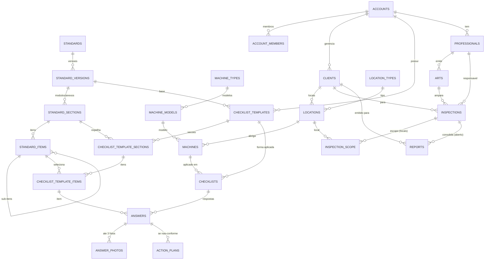

# Modelo de Dados — Conceitual e Lógico

> Fonte de verdade do schema: [`schema.dbml`](schema.dbml) (colável no
> dbdiagram.io). Segurança (RLS): [`rls-status.md`](rls-status.md).
> Identificadores em inglês; conteúdo em português (NR-12).
> A camada de **análise de dados** (foguinhos, base de conhecimento) e o
> **marketplace** são de **fase posterior** — fora desta base.

> **Sincronizado com o banco:** o modelo agora tem **26 tabelas** —
> entrou `profiles` (1:1 com `auth.users`, dados da pessoa), e `checklists`
> ganhou `inspection_id` (liga o checklist aplicado ao serviço/inspeção).
> O ERD abaixo é conceitual; para colunas/constraints exatas use o
> `schema.dbml`.

## As quatro camadas

| Camada | Comportamento | `account_id`? |
|---|---|---|
| **Referência** | Global, versionada, imutável | Não (global) |
| **Formas de checklist** | Recortes da norma feitos pelo tenant | Só na raiz (`checklist_templates`) |
| **Cadastro** | Quem/o quê do tenant | Só nas raízes |
| **Transacional** | Os eventos (inspeção, respostas, laudo) | Derivado das raízes |

**Tenancy normalizada:** `account_id` vive só nas raízes do tenant
(`clients`, `checklist_templates`, `professionals`, `account_members`); o
resto deriva pela cadeia de FKs (ver [ADR 0006](../adr/0006-normalized-tenancy.md)).

## Os três níveis do checklist (conceito central)

- **Completo** = `standard_version` + todos os seus `standard_items` (a
  norma inteira — o universo).
- **Forma** = `checklist_template` (um recorte do universo, agrupado em
  `checklist_template_sections` → `checklist_template_items`).
- **Aplicado** = `checklists` (uma forma aplicada a uma máquina, com as
  `answers`).

## ERD (base)

## Decisões-chave da base

- **Norma versionada e imutável**; a portaria de origem fica embutida na
  versão (sem tabela de histórico).
- **Hierarquia de máquina** em 3 níveis: `machine_types → machine_models →
  machines`. Ano de fabricação na unidade.
- **Local de inspeção** (`locations`) entre cliente e máquina; o escopo da
  inspeção é por **local**.
- **Checklist = forma (molde) + aplicado (instância)**. Forma agnóstica de
  máquina; aplicado liga forma + máquina.
- **Não-conformidade não é entidade** — é uma `answer` com status
  `non_compliant` (+ risco, fotos, plano de ação).
- **Matriz de risco como dado** (`risk_matrix_rules`).

## Pontos em aberto (registrados no schema)

- Ligação `checklists` ↔ `inspections` (deixada para depois).
- `reports` 1:1 com inspeção vs consolida várias.
- `machine_models` global vs por-tenant.

## Fora desta base (fase posterior)

Camada de **análise de dados** — agregados de frequência ("foguinhos"),
base de conhecimento com embeddings (pgvector) e sugestões — e a camada de
**marketplace**. Serão adicionadas como camadas auxiliares depois que a
base estiver de pé. Desenho preservado no histórico do Git.
